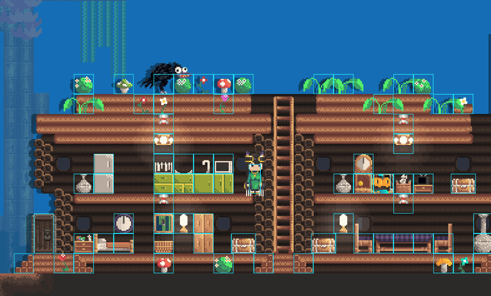

# Entity

Entities are the core building blocks of game logic in AngeliA. Most interactive objects in a map—such as crates, characters, bullets, and more—exist in the form of **entities**. You can use the **Entity Debugger** to inspect and test entities currently active on the stage.

### Callback Methods

Entity classes receive system events via callback methods. You can override these methods to respond to the corresponding events. The available callbacks include:

- **`OnActivated`** 
  Called once when the entity is loaded into the stage.

- **`OnInactivated`** 
  Called once when the entity is unloaded from the stage.

- **`FirstUpdate`** 
  First update cycle, typically used to register physics colliders.

- **`BeforeUpdate`** 
  Second update cycle, used to handle physics motion logic. *(By this time, `FirstUpdate` has been called for all other entities.)*

- **`Update`** 
  Third update cycle, used for physics processing and entity-specific behavior.

- **`LateUpdate`** 
  Final update cycle, usually used for rendering the entity.
