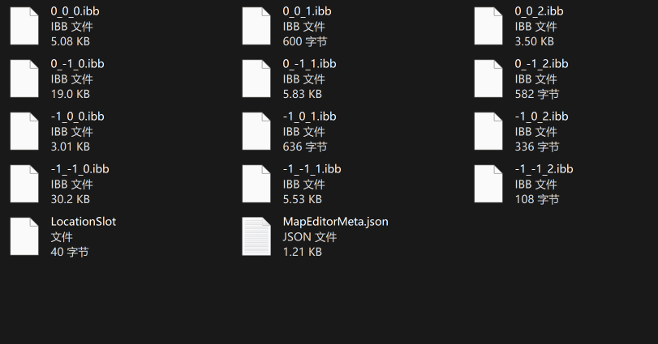
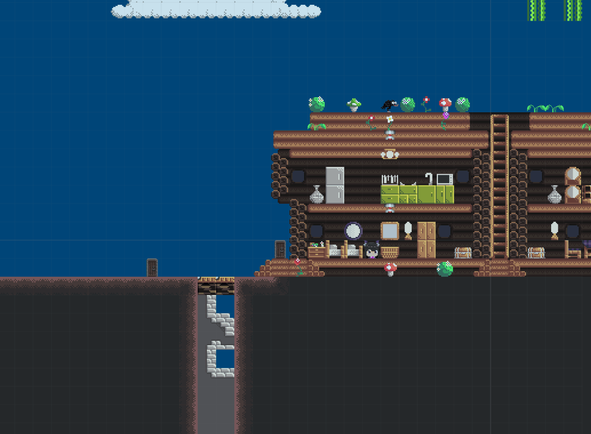

# 开放世界沙盒

本章将为您简要介绍地图关卡相关的内容，更详细的使用说明，请参阅后续章节。

### 地图文件

地图文件格式为 `ibb` 意为 `int byte byte`，每个`ibb`文件储存着 128 × 128 (块) 尺寸的地图，文件名为对应正方形区域的左下角的 x_y_z 坐标。文件内容为 int, byte, byte 为一组所串成的列表（例如 7126723, 0, 0, -467174, 1, 0, 892135, 2, 1,...），其中 int 为块名称的`AngeHash` ，第一个 byte 为块在地图内的本地 x 坐标，第二个 byte 为 y 坐标。当坐标超过 127 时，需将数值减去 128 得到真实数据。当 x\<128  y\<128 时，块为实体类型；当 x\<128  y≥128 时，块为辅助类型；当 x≥128  y\<128 时，块为关卡类型；当 x≥128  y≥128 时，块为背景类型；

 

### 地图逻辑

引擎会将多个地图无缝拼接并流畅展示给玩家，从而制造出开放世界的效果。只有游戏画面涉及的块会被展示出来，进入画面内的实体会被加载，移出画面外的实体会被卸载。

背景块不会碰撞其它物体；关卡块默认会碰撞其它物体，可添加单向板标签使其仅在特定方向阻止通过；实体块会加载一个承载着用户编写的逻辑的实例；辅助块只存在与后台数据中，不会被展示。

 

### 地图层

玩家可使用门或传送门前往相邻的地图层（如下图），引擎会在游戏进行时显示相邻的后置层。使用 `TeleportTask.TeleportFromDoor` 方法来传送玩家角色。

 

